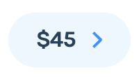
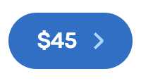
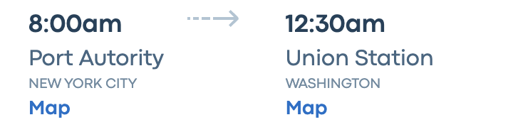
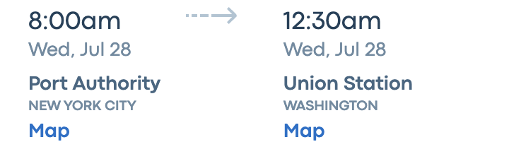
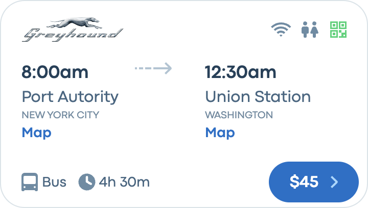
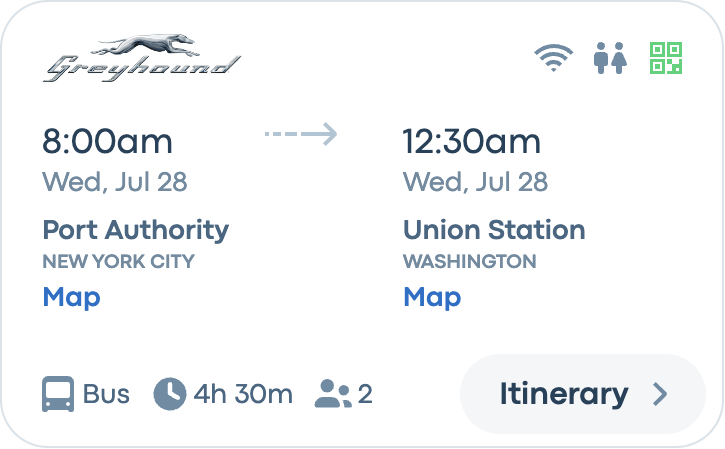
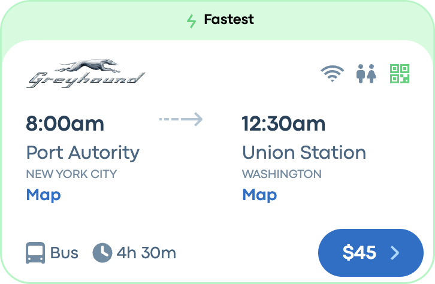
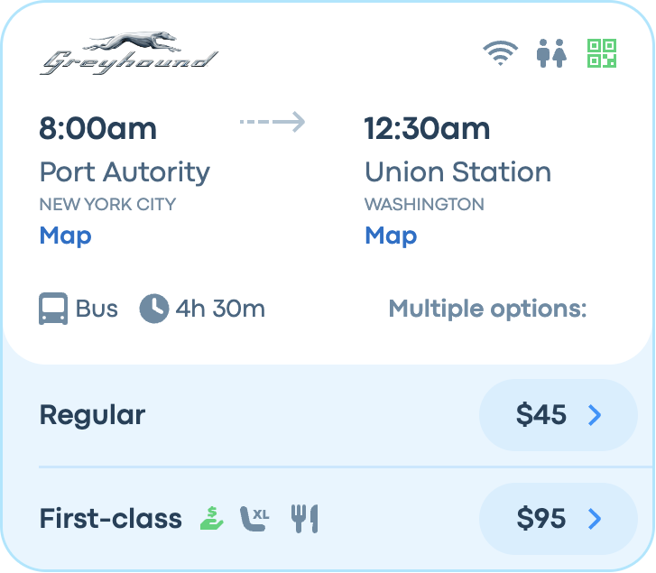

# UI Challenge

Here is the challenge completed!

## Launch Storybook

In the terminal, run **"npm run storybook"**.

## Components

Here are all the components.

### Chip

There are 3 different chips, light blue with price, dark blue with price and the itinerary chip.

### Header

### Footer

There are 3 different footer, the footer for the summary card and the two different footer for booking.

### Info

There are two different types of trip information; one for most of the cards component and another one specifically for the summary card.

## Cards

Here are all the cards with the sub-components integrated. On storybook, you can selecte fixed sizes for mobile and tablet, or responsive for a responsive card.

### Sellable Card

### Summary Card

### With Top Panel

### With Bottom Panel

